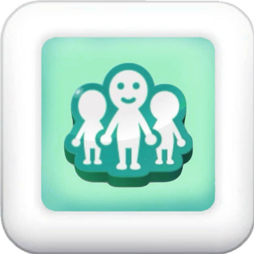

# HyperHLE

**The fastest, friendliest way to play classic iPhone OS games on your modern devices.**

---

## What is HyperHLE?

**HyperHLE** is a high-level emulator for early iPhone and iPod touch apps. It runs on modern desktops and Android, and it's written in Rust for speed and safety.

Unlike low-level emulators that try to simulate the whole iPhone chip-by-chip, HyperHLE takes a smarter route: it *becomes* iPhone OS. Instead of booting a real operating system inside a virtual machine, HyperHLE provides its own clean-room implementations of the system frameworks an app expects — Foundation, UIKit, OpenGL ES, OpenAL and more. The only code that runs on the [emulated CPU](https://github.com/merryhime/dynarmic) is the app itself and a small handful of libraries.

The result is an emulator that's **light, quick to start, and remarkably accurate** for the era it targets — early iOS games feel snappy and play the way you remember.

## Why HyperHLE is so good

- ⚡ **Fast where it counts.** The high-level emulation approach skips an entire layer of overhead. There's no OS to boot — apps launch almost instantly and stay responsive.
- 🎯 **Built for the games people actually love.** The OpenGL ES and OpenAL implementations are mature enough to drive a huge slice of early App Store classics with proper graphics and sound.
- 🦀 **Written in Rust.** Memory-safe, modern, and portable — the same codebase runs cleanly across Windows, macOS, Linux and Android.
- 🎮 **Flexible controls.** Mouse, touchscreen, and full game-controller support, including controller-to-touch and tilt simulation, so almost any setup works.
- 🛋️ **A real home screen.** A built-in app picker greets you with a clean iOS-style launcher — complete with a bundled **iOS 4 wallpaper** out of the box, so it feels like home the moment you open it.
- 🌐 **Local multiplayer.** Limited Wi-Fi multiplayer in supported games (like Asphalt 4 and N.O.V.A.) — you can even play against real iOS devices.
- 📦 **Zero faff.** Drop in a decrypted app, pick it from the launcher, and play.

> HyperHLE is built on top of the excellent open-source **touchHLE** project, with a refreshed identity and a few quality-of-life touches of our own. Huge respect and thanks to the upstream contributors who made this possible.

The goal is to bring back the early days of iOS gaming:

* **Today:** iPhone and iPod touch apps for iPhone OS 2.x and 3.0.
* **Soon:** iPhone OS 3.1, iPad apps (3.2), iOS 4.x, and beyond.

This project is not affiliated with or endorsed by Apple Inc. in any way. iPhone, iOS, iPod, iPod touch and iPad are trademarks of Apple Inc. in the United States and other countries. **Only use HyperHLE to emulate software you have obtained legally.**

## Platform support

* **Officially supported:** x64 Windows, x64 macOS, AArch64 Android. These are the platforms with binary releases. Apple Silicon Mac users report the x64 build works fine under Rosetta.
* **Build-it-yourself (works, no binaries):** AArch64 macOS, x64 Linux, AArch64 Linux.

### Input methods

- **Touch input** — four ways:
  - Mouse / trackpad (tap, hold and drag with the left button)
  - Virtual cursor via a game controller (right stick to move, stick-press or right shoulder to tap)
  - Map controller buttons or the left stick to fixed on-screen spots (`--button-to-touch=`, `--dpad-to-touch=`, `--stick-to-touch=` — see `OPTIONS_HELP.txt`)
  - Real touch input on touchscreen devices
- **Accelerometer input** — three ways:
  - Tilt simulation with a controller's left analog stick
  - Tilt simulation with the mouse (hold the right button)
  - Real accelerometer input on phones, tablets and similar devices

# Usage

First, get HyperHLE — either a binary release or by building it yourself (see below).

You'll also need an app to run. An app-compatibility database is a good guide for which versions of which apps are known to work, though it may contain outdated info. **The app binary must be decrypted to be usable.**

## Graphical user interface (the app picker)

HyperHLE has a built-in app picker. Put your `.ipa` files and `.app` bundles in the `touchHLE_apps` directory and they'll show up automatically when you launch HyperHLE.

To configure options, edit `touchHLE_options.txt`. For the full list of available options, see `OPTIONS_HELP.txt`.

## Special Android notes

*Windows, Mac and Linux users can skip this section.*

On Android, only the graphical app picker is available, so you must place your `.ipa` files or `.app` bundles inside the `touchHLE_apps` directory. Note that this directory only appears after you've run HyperHLE at least once.

File management can be tricky on newer Android versions due to [scoped storage restrictions](https://developer.android.com/about/versions/11/privacy/storage#scoped-storage). One of these usually works:

* Tap the **File manager** button in HyperHLE. You may also find HyperHLE in your device's file manager (often "Files" or "Downloads"). *Warning:* on some devices this button opens a file manager that crashes on actual file operations (an Android bug). If that happens, clear that file manager from recents and open your device's file manager app directly instead.
* On older Android, browse directly to `/sdcard/Android/data/org.touchhle.android/files/touchHLE_apps` (note: `/sdcard` is usually not the SD card).
* Use ADB. If you're new to ADB, try <https://yume-chan.github.io/ya-webadb/> in a WebUSB-capable browser with your device connected over USB, then navigate to "sdcard" → "Android" → "data" → "org.touchhle.android" → "files" → "touchHLE_apps".

## Command-line user interface

**This section does not apply on Android.**

Run with `--help` to see all command-line usage.

If you're on Windows and new to the command line:

1. Move the `.ipa` or `.app` into the same folder as the HyperHLE executable.
2. Hold **Shift**, right-click the empty space in that folder.
3. Click **Open with PowerShell**.
4. Type `.\HyperHLE.exe "YourAppName.ipa"` (or `.app`) and press Enter. To add options, put a space after the app name (outside the quotes) and list them separated by spaces.

## Local multiplayer

HyperHLE supports limited local Wi-Fi multiplayer in some games (e.g. Asphalt 4 and N.O.V.A.). Real iOS devices can join or host too.

1. Install HyperHLE on 2+ devices on the same Wi-Fi network.
2. **Important:** whitelist HyperHLE in your OS firewall / network settings.
3. Enable "Network access" in Quick options or via `--allow-network-access`.
4. Start or join multiplayer in the game.

**Notes:** Internet/VPN tunneling isn't officially supported (but may work); Bluetooth isn't supported. On macOS you may need to launch from the terminal so the OS doesn't block network connections.

## Other stuff

Anything the app saves (e.g. **saved games**) lives in the `touchHLE_sandbox` folder.

If the emulator crashes almost immediately while running a **known-working** game, check for overlays such as the Steam overlay, Discord overlay, or RivaTuner Statistics Server. These inject themselves into other apps and don't always clean up after themselves, which can break HyperHLE. 😢

# Building and contributing

See `CONTRIBUTING.md` if you'd like to contribute. If you just want to build HyperHLE, follow `dev-docs/building.md`.

# License

HyperHLE is a fork of **touchHLE** © 2023–2026 touchHLE project contributors, with additional changes © the HyperHLE contributors.

The source code of HyperHLE itself (not its dependencies) is licensed under the Mozilla Public License, version 2.0. Due to license-compatibility concerns, binaries are under the GNU General Public License version 3 or later.

For a best-effort listing of all dependency licenses, build HyperHLE and pass `--copyright`, or click the "Copyright info" button in the app picker.

Different licensing terms apply to the bundled dynamic libraries (in `touchHLE_dylibs/`) and fonts (in `touchHLE_fonts/`) — see those directories for details.

# Thanks

We stand on the shoulders of giants. Thank you to:

* The **touchHLE** project and all of its contributors — HyperHLE wouldn't exist without your work.
* Everyone who has contributed to the project or supported any of its contributors.
* The [Rust project](https://www.rust-lang.org/).
* Everyone who has documented the iPhone OS platform, officially or otherwise.
* The iOS hacking/jailbreaking community.
* The Free Software Foundation, for keeping libgcc and libstdc++ copyleft and saving this project from ABI hell.
* The National Security Agency of the United States, for [Ghidra](https://ghidra-sre.org/).
* Developers of early iPhone OS apps — what treasures you created!
* Apple, and NeXT before them, for creating such fantastic platforms.
